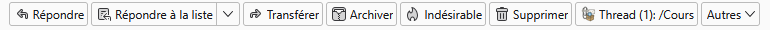

# Thunderbird MROF (Move Reply to Original Folder)

> **Fonction :** un bouton ajouté dans la barre d’outils de lecture d’un message affiche :
>
> ```
> Fil (N) : /chemin/du/dossier
> ```
>
> – **N** est le nombre de messages détectés dans la conversation  
> – Le dossier est celui du premier message **hors** Courrier entrant / Spam / Brouillons / Envoyés
>
> Un clic déplace immédiatement le message affiché dans ce dossier.  
> Le bouton est grisé si aucun dossier valide n’est trouvé.

---



## Fonctionnement

1. **Détection** : `background.js` intercepte `messageDisplay.onMessageDisplayed`, lit uniquement les en‑têtes avec `messages.getRaw`, extrait tous les `<Message-ID>` et calcule `count`.
2. **Recherche** : pour chaque ID, une requête `messages.query({headerMessageId})` est lancée ; on retient le premier résultat dont le dossier ne correspond pas à Inbox/Spam/Drafts/Sent.
3. **Mise à jour** : le bouton reçoit le titre `Fil (N) : dossier`. S’il n’y a pas de dossier valide, il est désactivé (`message_display_action.disable`).
4. **Popup (legacy)** : si `default_popup` est présent (cf. `manifest.json`), `popup.js` fournit une confirmation manuelle avant déplacement.
5. **Déplacement** : au clic, `background.js` (ou `popup.js` si confirmé) exécute `messages.move()`, puis affiche une notification native de succès.

### Fonctionnalités

| Fonction                        | Détails                                                                                                                                                                                                                                                                    |
| ------------------------------- | -------------------------------------------------------------------------------------------------------------------------------------------------------------------------------------------------------------------------------------------------------------------------- |
| Bouton `message_display_action` | Affiché dans la barre d’outils de la vue message ([MDN messageDisplayAction](https://webextension-api.thunderbird.net/en/stable/messageDisplayAction.html)).                                                                                                               |
| Détection rapide du fil         | Lecture minimale des en‑têtes avec [`browser.messages.getRaw`](https://webextension-api.thunderbird.net/en/stable/messages.html#getraw-messageid-options); extraction de `Message-ID`, `References`.                                                                       |
| Recherche éclair du dossier     | Interrogation parallèle de [`browser.messages.query`](https://webextension-api.thunderbird.net/en/stable/messages.html#query-queryinfo); court‑circuit dès qu’un dossier valide est trouvé.                                                                                |
| Cache mémoire                   | Map « threadId → dossier » pour éviter les requêtes répétées.                                                                                                                                                                                                              |
| Grisage dynamique du bouton     | Activation/désactivation via [`browser.messageDisplayAction.enable`](https://webextension-api.thunderbird.net/en/stable/messageDisplayAction.html#enable-tabid) / [`disable`](https://webextension-api.thunderbird.net/en/stable/messageDisplayAction.html#disable-tabid). |
| Déplacement instantané          | Déplacement avec [`browser.messages.move`](https://webextension-api.thunderbird.net/en/stable/messages.html#move-messageids-folderid) et notification native de succès.                                                                                                    |
| Compatibilité                   | Testé sous Thunderbird 128 ESR (Manifest V2).                                                                                                                                                                                                                              |

---

## Installation (mode développeur)

1. Ouvre Thunderbird ≥ 115 ESR.
2. **Outils → Modules complémentaires → ⚙ → Déboguer les modules**.
3. **Charger un module temporaire** et sélectionne `manifest.json`.
4. Ouvre un message pour voir le bouton.

---

## Utilisation

| État du bouton | Signification                                                  |
| -------------- | -------------------------------------------------------------- |
| 🟢 **Actif**   | Un dossier valide a été trouvé ; cliquer déplace le message.   |
| ⚪ **Gris**    | Aucun dossier valide (ou erreur) ; le message reste où il est. |

---

## Fichiers du projet

| Fichier            | Rôle                                                                                                          |
| ------------------ | ------------------------------------------------------------------------------------------------------------- |
| `manifest.json`    | Déclaration MV2, définition de l’action `message_display_action`, permissions minimales fileciteturn2file1 |
| `background.js`    | Calcul du titre, gestion du cache, activation/désactivation, déplacement sans popup                           |
| `popup/popup.html` | Popup de confirmation affichant infos + boutons Oui/Non fileciteturn2file0                                 |
| `popup/popup.js`   | Logique côté popup : extraction des IDs, appel messages & déplacement                                         |
| `icons/`           | Icônes (256 px affichée et redimensionnée)                                                                    |

### Structure

```
move-reply/
├── manifest.json
├── background.js
├── icons/
│   └── clippy-256.ico
└── popup/
    ├── popup.html
    └── popup.js
```

---

## Développer & déboguer

Utilisez **Examiner** dans la page _Déboguer les modules_ pour afficher la console background et celle du popup.
